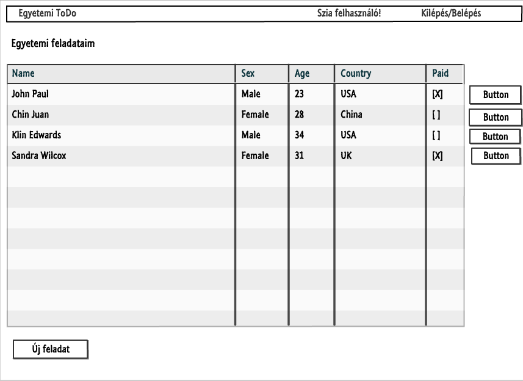
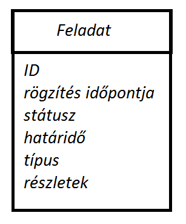

# Alkfejl_Bead1

##1) Követelményanalízis

###Funkcionális elvárások:
- Legyen lehetőség regisztrációra.
- Az alkalmazással a regisztrált felhasználók tudjanak:
	- felvenni feladatokat
	- reszletek megtekintése
	- szerkeszteni feladatokat
	- törölni feladatokat

###Nem funkcionalis elvárások:
- Használhatóság:
	legyen egyértelmű, önmagyarázó a felület
- Teljesítmény:
	a válaszidő legyen elég gyors, hogy az alkalmazás használata kényelmes legyen
- Rendelkezésre állás:
	szorgalmi- és vizsgaidőszakban legyen 99%-ban elérhető
- Skálázhatóság:
	a becsült felhasználó-létszám nem igényel skálázható rendszer tervezését kezdetben
- Biztonság:
	szükséges esetben hibajelzéssel figyelmeztetjük a felhasználót, hogy helyesen adja meg az adatokat,
	a jelszavukat kódolva tároljuk
- Karbantarthatóság: 
	legyen könnyen bővíthető az alkalmazás, a megjelenés legyen elválasztva az adatoktól és a vezérléstől, legyen könnyű 	a megjelenés módosítása.		
- Vevői megszorítások: 
	az alkalmazásnak online elérhetőnek kell lennie 
	2015. november 1-től

###Használatieset-modell:

###Szerepkörök:
- vendég: 
	Az a felhasználó, aki azonosítatlanul használja az alkalmazást. A weben a legtöbb látogató ilyen. 
	A vendég felhasználó csak a publikus oldalakat és funkciókat érheti el. 
	Ilyenek a főoldal, valamint a bejelentkezés és regisztráció.
- bejelentkezett, azonosított felhasználó: 
	A bejelentkezett felhasználók a publikus oldalakon kívül az összegyűjtött feladatok oldalt, 
	a részletek és a szerkesztési oldalakat is használhatja.
	Tarolt adatok: neptun kód, jelszó, vezetéknév, keresztnév, avatar,
	
###Használati eset diagram:

Folyamatok pontos menete:
	Új feladat velvétele: Ha még nem regisztráltál akkor meg kell tenned. 
	Ha már regisztrált felhasználó vagy akkor bejelentkezés után, a lista oldalon, az új feladat felvétele gombra 			kattattintva jutsz el a szerkesztő felületre. Itt ki kell töltened az összes mezőt, majd a mentés gombra 			kattintva felveheted az új feladatodat.

##2) Tervezés:
###Architektúra terv
Oldaltérkép:
	Publikus:
	- Főoldal
	- Login
	- Regisztráció

	Felhasználó:
	- Főoldal
	- Login/Logout
	- Feladat lista
    	+ új feladat
    	+ feladat megtekintése
        + feladat szerkesztése
	    + feladat törlése

Végpontok:
	GET /: főoldal
	GET /login: bejelentkező oldal
	POST /login: bejelentkezési adatok felküldése
	GET /list: feladatlista oldal
	GET /new: új feladat felvitele
	POST /new: új feladat felvitele, adatok küldése
	GET /edit/:id: feladat szerkesztése
	POST /edit/:id: feladat szerkesztése, adatok küldése
	GET /delete/:id: feladat törlése

###Felhasználóifelület-modell:
Oldalvázlatok

Osztálymodell:

##3) Implementáció:
###Fejlesztői környezet bemutatása:
	c9.io fejlesztői környezetben elkészített node.js projekt, ami Github kódtárban van tárolva.

###Könyvtárstruktúrában lévő mappák funkiójának bemutatása:
- config: waterline használatához szükséges konfiguráció
- controllerek: az oldalak eléréséhez és adatok feltöltéséhez szükséges kontrollerek
- models: A feladatok és a felhasználók modellje
- view: kinézetek

###4) Tesztelés:

###5) Felhasználói dokumentáció:
